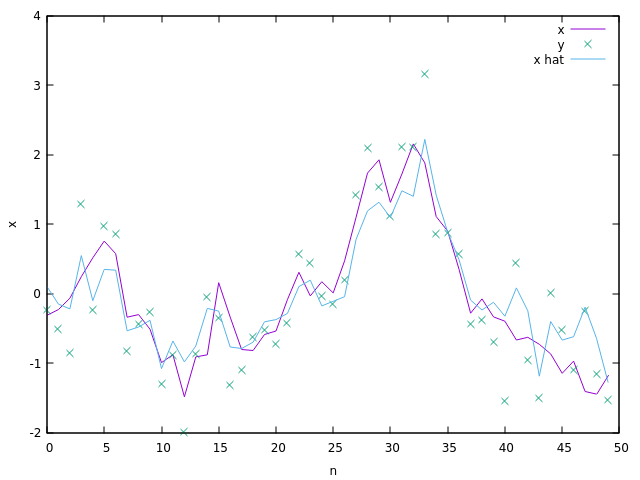

# Sequential Models

Implements state space models and hidden markov models, with kalman filters and particle filters to make estimate the hidden state from observations.

Different executables are compiled for different test cases, all of which print their results to stdout for simplicity.

Shell scripts and gnuplot configs are available for plotting these results.

Below is an example of a particle filter state estimate using gaussian sampling.

